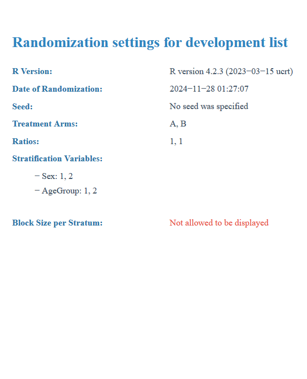

```{r, include = FALSE}
knitr::opts_chunk$set(
  collapse = TRUE,
  comment = "#>"
)
```


# Introduction

`RandCap` is an R package designed to streamline and enhance randomization in clinical trials. Built upon the functionality of the blockrand package, it extends and refines blocked randomization methods to offer greater flexibility and usability. By leveraging blockrand, RandCap provides a solid foundation for creating robust and reproducible randomization processes.

The primary goal of RandCap is to provide an accessible syntax that enables datamanagers, biostatisticians and trial designers without extensive knowledge in programming to implement easily the randomization code.

This vignette demonstrates the key features of `RandCap` with practical examples.


# Installation

To install the development version of `RandCap`:
```{r}
devtools::install_github("seydoug007/RandCap")
```


# Load the library
```{r}
library(RandCap)
```


# Generate a Basic Randomization List

This chapter demonstrates how to use the RandCapGen function to generate a basic randomization list with equal allocation to two treatment arms.

The parameters used in this example are:

- *n*: The total number of participants to randomize (100).
- *block_sizes*: A vector of block sizes to use for randomization (blocks of size 2 and 4).
- *arms*: The treatment arms, labeled as "A" and "B".
- *seed*: A seed for reproducibility of the randomization process.

This function assigns subjects to specified treatments within sequential blocks. Among the predefined block sizes, the function randomly determines the number of blocks for each size. Consequently, the total number of randomizations in the generated list may exceed nn, as the allocation process depends on the random selection and distribution of block sizes.


```{r}
rand_dev_list <- RandCapGen(
  n = 100,
  block_sizes = c(2, 4),
  arms = c("A", "B"),
  seed = 1234
)
```


# Stratified Randomization

To implement stratified randomization using RandCapGen, you need to define stratification variables in a structured and precise manner. The parameters related to stratification are passed as a list object, which ensures that each stratification variable and its corresponding levels are clearly specified and easily interpretable.

In this example, stratification is implemented for two variables: Sex (with levels "M" for male and "F" for female) and AgeGroup (with levels "Y" for young and "O" for old). The strat_vars parameter is used to pass these variables and their levels to RandCapGen.


```{r}
rand_list_strat <- RandCapGen(
  n = 100,
  block_sizes = c(2, 4),
  arms = c("A", "B"),
  strat_vars = list(Sex = c("M", "F"), AgeGroup = c("Y", "O")),
  strat_vars_prefix = list(Sex = "SEX_", AgeGroup = "AGE_"),
  seed = 5678
)
```


# View the full dataset

The full dataset provides a comprehensive view of the randomization table, including patient identifiers, block assignments, and stratum identifiers (if stratification is applied). This detailed output not only offers transparency but also ensures a robust randomization process. By accessing the dataset directly through the object generated by RandCapGen, users can verify the integrity of the randomization process. This includes confirming that blocks and strata have been assigned correctly, as well as ensuring that the allocation adheres to the predefined parameters set during the randomization setup.

For instance, the dataset includes unique patient IDs, block sizes, and stratification variables, all of which are critical for detailed analysis and reproducibility. Whether used for regulatory documentation or internal validation, this feature of RandCap simplifies the oversight of complex randomization schemes.

```{r}
head(rand_list_strat$tables$full_dataset)

```


# View the simplified dataset

The simplified dataset provides a streamlined version of the randomization table, focusing only on the treatment arm assignments and, when stratification is applied, the stratification variables. This concise format is particularly useful for quick reference or for importing directly into external systems, such as REDCap, where only the allocation information is required.

Unlike the full dataset, the simplified dataset excludes detailed block information and participant identifiers. Instead, it provides just the treatment arms and any stratification variables, ensuring a clear and concise format for practical use.


```{r}
head(rand_list_strat$tables$simplified_dataset)
```


# Finalize Production Randomization

The concept behind the RandCapProd function is to take the testing (or development) randomization list (initially generated by the function `RandCapGen`) and reshuffle it to create a new sequence of randomization suitable for production. This reshuffling involves both the blocks and the treatments within each block, ensuring that the production list is distinct while maintaining the same overall design parameters, such as block sizes, treatment arms, and stratification variables.

The function is particularly useful when you don't want to generate another list using RandCapGen but instead aim to reshuffle the development list while preserving the same structure.

```{r}
prod_list <- RandCapProd(randomization_object = rand_list_strat, seed = 9876)

```


# Customizing Column Names

If you need to rename the columns in the randomization tables to adhere to a specific naming convention or format, you can directly modify the relevant table within the randomization object. For example, to rename the columns in the simplified dataset, you can assign new names to its column names as shown below:

```{r}
colnames(rand_list_strat$tables$simplified_dataset) <- c("rando_bras", "Rando_Sex", "Rando_AgeGroup")

head(rand_list_strat$tables$simplified_dataset)
```


# Assess Randomization Balance

The RandCapBalance function is a core feature of the RandCap package. Its purpose is to ensure the randomization process has distributed participants evenly across treatment arms and, when applicable, within stratification groups. As part of its functionality, the function not only calculates balance metrics but also generates a detailed PDF report summarizing the results.

The user must pass the randomization_object to `RandCapBalance` to generate the report. By default, the PDF is saved in your working directory

```{r}
RandCapBalance(
  randomization_object = rand_list_strat)
```

{width=100%}


# Export Randomization Settings

The RandCapSettings function in the RandCap package provides a comprehensive overview of the randomization parameters used in a study. This function generates a detailed PDF document summarizing these settings, making it an essential tool for documenting the design and ensuring transparency and reproducibility.

```{r}

RandCapSettings(rand_obj = rand_list_strat)
```

{width=100%}


# Export Tables for REDCap

The RandCapTable function in the RandCap package facilitates the creation and export of randomization tables from the randomization object generated by RandCapGen. It allows users to generate:

A full dataset containing all randomization details, such as block sizes, patient IDs, and stratification variables (if applicable).

A simplified randomization list, which is ready for direct implementation in external systems like RedCap.

This function provides flexibility through arguments that specify which datasets to generate. Users must explicitly set the desired dataset options (save_for_REDCap and save_random_table) to TRUE to ensure the corresponding files are created.


```{r}
RandCapTable(
  randomization_object = rand_list_strat,
  save_for_REDCap = TRUE,
  save_random_table = TRUE
)
```


# Custom Ratios

The RandCap package provides flexibility to assign participants to treatment arms with custom allocation ratios. When required, these ratios can be easily specified to reflect the desired distribution across treatment groups. The following example demonstrates how to set up a randomization with three treatment arms (A, B, and C) using a custom ratio of 1:2:2, respectively.


```{r}
rand_custom_ratio <- RandCapGen(
  n = 300,
  block_sizes = c(5, 10),
  arms = c("A", "B","C"),
  ratio = c(1,2,2),
  seed = 3456
)
```


# Testing the balance of different ratio assignment

Here we can test the balance of the randomization scheme with different ratios.

```{r}
RandCapBalance(rand_custom_ratio)
```

{width=100%}


