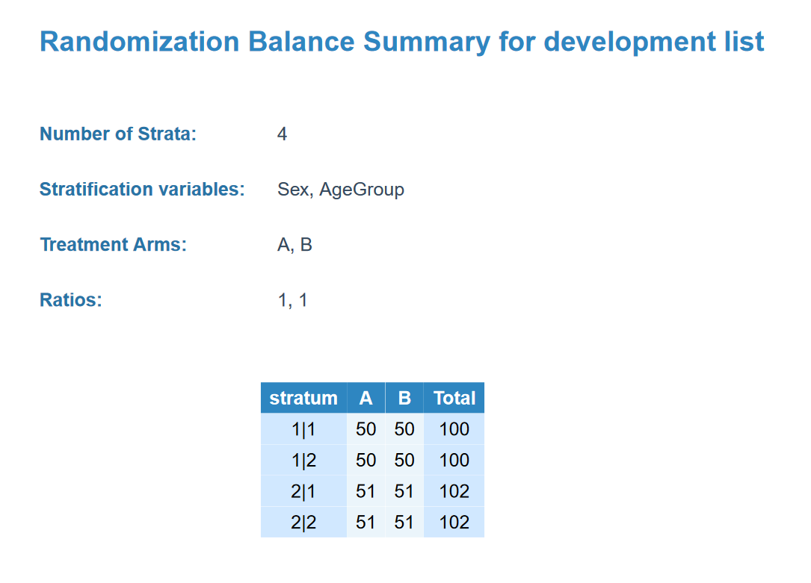

```{r, include = FALSE}
knitr::opts_chunk$set(
  collapse = TRUE,
  comment = "#>"
)
```


# Introduction

`RandCap` is an R package designed to streamline randomization in clinical trials. It provides robust and customizable randomization strategies, supporting blocked randomization, stratification by variables, and variable allocation ratios. The package is tailored for researchers and trial designers who require balanced allocation schemes and reproducible randomization processes.

This vignette demonstrates the key features of `RandCap` with practical examples.

# Installation

To install the development version of `RandCap`:

devtools::install_github("seydoug007/RandCap")

# Load the library
```{r}
library(RandCap)
```


# Generate a Basic Randomization List

This vignette demonstrates how to use the RandCapGen function to generate a basic randomization list with equal allocation to two treatment arms.

The parameters used in this example are:

- *n*: The total number of participants to randomize (100).
- *block_sizes*: A vector of block sizes to use for randomization (blocks of size 2 and 4).
- *arms*: The treatment arms, labeled as "A" and "B".
- *seed*: A seed for reproducibility of the randomization process.

```{r}
rand_dev_list <- RandCapGen(
  n = 100,
  block_sizes = c(2, 4),
  arms = c("A", "B"),
  seed = 1234
)
```


# Stratified Randomization

To implement stratified randomization using RandCapGen, you need to define stratification variables in a structured and precise manner. The parameters related to stratification are passed as a list object, which ensures that each stratification variable and its corresponding levels are clearly specified and easily interpretable.

In this example, stratification is implemented for two variables: Sex (with levels "M" for male and "F" for female) and AgeGroup (with levels "Y" for young and "O" for old). The strat_vars parameter is used to pass these variables and their levels to RandCapGen.


```{r}
rand_list_strat <- RandCapGen(
  n = 100,
  block_sizes = c(2, 4),
  arms = c("A", "B"),
  strat_vars = list(Sex = c("M", "F"), AgeGroup = c("Y", "O")),
  strat_vars_prefix = list(Sex = "SEX_", AgeGroup = "AGE_"),
  seed = 5678
)
```


# View the full dataset

The full dataset provides a comprehensive view of the randomization table, including patient identifiers, block assignments, and stratum identifiers (if stratification is applied). This detailed output allows you to verify the integrity of the randomization process, ensuring that blocks and strata have been assigned correctly and that the allocation adheres to the predefined parameters."

```{r}
head(rand_dev_list$tables$full_dataset)

```


# View the simplified dataset

The simplified dataset provides a streamlined version of the randomization table, focusing only on the treatment arm assignments and, when stratification is applied, the stratification variables. This concise format is particularly useful for quick reference or for importing directly into external systems, such as REDCap, where only the allocation information is required.

Unlike the full dataset, the simplified dataset excludes detailed block information and participant identifiers. Instead, it provides just the treatment arms and any stratification variables, ensuring a clear and concise format for practical use.


```{r}
head(rand_list_strat$tables$simplified_dataset)
```


# Finalize Production Randomization

The concept behind the RandCapProd function is to take the testing (or development) randomization list and reshuffle it to create a new sequence of randomization suitable for production. This reshuffling involves both the blocks and the treatments within each block, ensuring that the production list is distinct while maintaining the same overall design parameters, such as block sizes, treatment arms, and stratification variables.

The function is particularly useful when you don't want to generate another list using RandCapGen but instead aim to reshuffle the development list while preserving the same structure.

```{r}
prod_list <- RandCapProd(randomization_object = rand_list_strat, seed = 9876)

```


# Customizing Column Names

```{r}
colnames(rand_dev_list$tables$simplified_dataset) <- c("NewName1", "NewName2", "NewName3")

```


# Assess Randomization Balance

```{r}
RandCapBalance(
  randomization_object = rand_list_strat,
  output_path = "Balance_Summary.pdf"
)
```

{width=50%}


# Export Randomization Settings
```{r}

RandCapSettings(rand_obj = rand_list, output_path = "Settings_Summary.pdf")
```

{width=50%}


# Export Tables for REDCap
```{r}
RandCapTable(
  randomization_object = rand_list,
  save_for_REDCap = TRUE,
  save_random_table = TRUE
)
```

# Custom Ratios

```{r}
rand_custom <- RandCapGen(
  n = 90,
  block_sizes = c(18, 18),
  arms = c("Treatment", "Control"),
  ratio = c(2, 1),
  seed = 3456,
  project_acronym = "RCT"
)
```


# View the dataset
```{r}
head(rand_custom$tables$full_dataset)
```

# Visualization
```{r}
library(ggplot2)

ggplot(rand_list$tables$full_dataset, aes(x = treatment_arm)) +
  geom_bar(fill = "skyblue") +
  labs(title = "Treatment Arm Distribution", x = "Treatment Arm", y = "Count") +
  theme_minimal()
```


